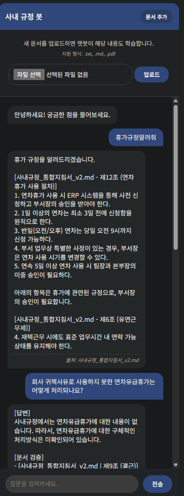
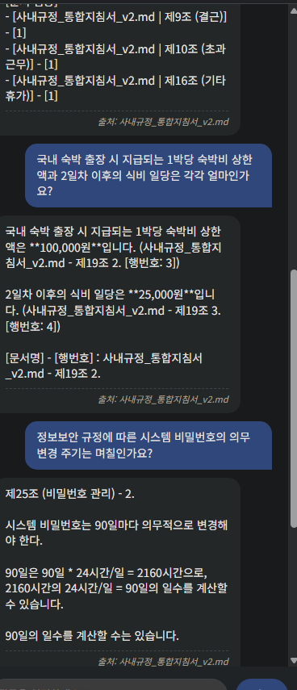
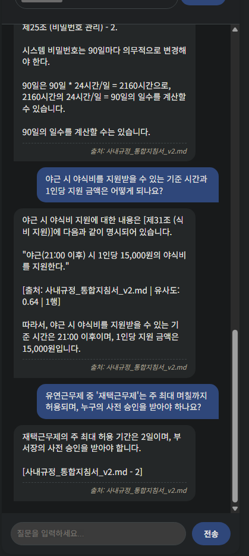

# 사내 규정 도우미 RAG Chatbot

## 📌 프로젝트 소개

사내 문서(txt, md, pdf)를 업로드하면 해당 문서를 기반으로 질문에 답변하는 RAG 챗봇입니다.  
OpenAI 프롬프트 엔지니어링으로 생성한 가상의 사내 규정 문서를 활용하며, 답변 시 참고 출처를 함께 제공합니다.

---

## 🖥️ 실행 화면

| 문서 업로드 및 휴가규정 질의 | 출장비·비밀번호 질의 | 야식비·재택근무 질의 |
|:---:|:---:|:---:|
|  |  |  |

---

## 🛠️ 기술 스택

- **Backend**: Python, FastAPI, ChromaDB, SentenceTransformers
- **Frontend**: HTML, CSS, JavaScript
- **LLM**: Groq (Llama 3.1) — OpenAI GPT에서 무료 API로 전환
- **임베딩**: `jhgan/ko-sbert-nli` — 범용 다국어 모델에서 한국어 특화 모델로 교체
- **Vector DB**: ChromaDB

---

## ⚙️ 설치 및 실행 방법

```bash
# Python 3.11 ~ 3.13
pip install -r requirements.txt
python main.py
```

이후 `clients/index.html`을 VS Code Live Server로 실행합니다.

---

## 📁 프로젝트 구조

```
doc-search-chatbot/
├── servers/          # FastAPI 백엔드 서버
├── clients/          # 프론트엔드 (HTML/CSS/JS)
│   └── sample_data/  # 테스트용 문서
└── image/            # 실행 화면 스크린샷
```

---

## ✅ 주요 기능

- 사내 문서(txt, md, pdf) 업로드 및 벡터 저장
- 문서 기반 RAG 응답 생성 및 참고 출처 표기
- 문서에 없는 내용은 "없다"고 명시
- **Semantic Chunking** — 의미 변화 지점을 감지하여 자동 분할
- **한국어 특화 임베딩** — `jhgan/ko-sbert-nli` 모델 적용
- **환경변수 기반 설정** — API 키 및 서버 설정을 `.env`로 분리 관리

---

## 🔍 RAG 파이프라인

```
(업로드) txt, md, pdf 형식 지원
  ↓
(청킹) 문서를 의미 단위로 분할 — Semantic Chunking 적용
       · 문장 임베딩 → 인접 문장 간 코사인 거리 계산 → 주제 변화 지점에서 분할
       · 오버랩 설정으로 청크 간 문맥 연결
       · Semantic Chunking 실패 시 조항 단위 청킹으로 자동 대체
  ↓
(임베딩) 텍스트 → 벡터 변환 (SentenceTransformer)
  ↓
(저장) ChromaDB에 벡터 및 메타데이터 저장
  ↓
(질문) 프롬프트 엔지니어링 적용
       · persona, positive/negative 지시, 출력 형식 지정
  ↓
(검색) 코사인 유사도 기반 벡터 검색
  ↓
(응답) 유사도 임계값 초과 청크를 컨텍스트에 포함하여 LLM 응답 생성
       · 참고 출처 표기 / 문서에 없는 내용은 명시
```

---

## 🧪 실험 및 분석

### 1. 문서 형식별 RAG 성능 정량 비교

동일한 8개 질문을 **MD 단독**(v2.md만 업로드)과 **TXT+MD 병합**(v1.txt 추가 업로드) 두 조건에서 테스트하여 답변 품질을 비교하였습니다.

> 테스트 환경: Groq llama-3.1-8b-instant / jhgan/ko-sbert-nli  
> 평가 기준: 정확성(40) + 완전성(25) + 출처정확도(20) + 간결성(15) = 100점 만점

#### 질문별 결과

| # | 질문 | MD 단독 | TXT+MD | 차이 | 비고 |
|---|------|---------|--------|------|------|
| Q1 | 휴가규정 | 85 | 88 | +3 | 병합 시 기타휴가(제16조)까지 포함 |
| Q2 | 연차유급휴가 귀책사유 처리 | **20** | **92** | **+72** | MD: "내용 없음" 오답 / 병합: "수당 지급" 정답 |
| Q3 | 숙박출장 숙박비·식비 | 96 | 83 | -13 | MD가 간결, 병합은 원문 과다 노출 |
| Q4 | 비밀번호 변경 주기 | 73 | 95 | +22 | MD: 불필요한 시간 환산 잡음 |
| Q5 | 야식비 기준시간·금액 | 93 | 95 | +2 | 양쪽 정답 |
| Q6 | 재택근무 최대일수·승인자 | 88 | 93 | +5 | 양쪽 정답 |
| Q7 | 표준 출퇴근·점심시간 | 95 | 94 | -1 | 양쪽 정답 |
| Q8 | 출퇴근 누락 ERP 등록기한 | 100 | 95 | -5 | 양쪽 정답 |

#### 종합 점수

| 항목 | MD 단독 | TXT+MD 병합 |
|------|---------|-------------|
| **평균 점수** | 81.2 | **91.9 (+10.7)** |
| 정확성 (40점) | 33.8 (84%) | 39.1 (98%) |
| 완전성 (25점) | 19.4 (78%) | 22.5 (90%) |
| 출처정확도 (20점) | 16.5 (83%) | 17.1 (86%) |
| 간결성 (15점) | 11.6 (77%) | 13.1 (87%) |
| 정답률 (80점 이상) | 6/8 (75%) | 7/8 (88%) |
| 치명적 오류 | 1건 | **0건** |
| 표준편차 | 25.8 | **4.3** |

#### 분석

**TXT+MD 병합이 우수한 이유** — MD는 `##` 기반 조항 단위 청킹, TXT는 고정 크기(300자) 청킹을 사용합니다. 서로 다른 전략이 상호보완하여 한쪽이 놓치는 내용을 다른 쪽이 커버합니다. 실제로 Q2에서 MD 단독은 제11조 5항을 검색하지 못해 "없다"고 오답했지만, TXT 청킹이 해당 내용을 포함하여 정답을 찾았습니다.

**MD 단독이 우수한 경우** — Q3처럼 하나의 조항에 답이 집중된 질문에서는 조항 단위 청크가 깔끔한 답변을 생성합니다. 병합 시에는 중복 출처로 인해 오히려 가독성이 떨어질 수 있습니다.

**핵심 약점** — Q2의 오답(20점)은 문서에 존재하는 내용을 "없다"고 답한 치명적 오류로, 단일 청킹 전략만으로는 검색 누락을 완전히 방지할 수 없음을 보여줍니다.

#### 결론

TXT+MD 병합 방식이 종합 점수 +10.7점, 표준편차 4.3(vs 25.8)으로 답변 품질과 안정성 모두 우수합니다. 복수 형식을 병합하여 검색 커버리지를 확보하고, LLM 프롬프트에서 간결성을 강화하여 중복 노출을 줄이는 것이 최적 운용 전략입니다.

#### **⚡ 향후 개선 방향**

Q2의 사례처럼, RAG 시스템은 검색에 실패하면 문서에 존재하는 내용조차 "없다"고 답변하는 **할루시네이션 한계**를 보였습니다. <u>**이를 보완하기 위해 LLM 시스템 프롬프트에 거짓 답변 생성 방지 규칙을 강화하고, 생성된 답변을 원본 문서와 대조하여 검증하는 노드를 파이프라인에 추가**</u>한다면 이러한 한계를 줄일 수 있을 것입니다.

### 2. 청킹 크기 최적화

고정 크기 청킹 방식에서는 크기에 따라 상반된 문제가 발생했습니다.

| 청크 크기 | 문제점 |
|----------|--------|
| 너무 큰 경우 | 하나의 청크에 여러 주제가 담겨 벡터가 희석되고 유사도 정확도가 저하됨 |
| 너무 작은 경우 | 문맥이 끊겨 의미 파악이 어려워짐 |

적절한 크기를 실험으로 탐색하면서 고정 크기 청킹 자체의 구조적 한계를 확인하였고, 이를 보완하기 위해 Semantic Chunking(문장 간 임베딩 유사도를 계산하여 의미 단위로 자동 분할)을 도입하였습니다.

### 3. 보안 구조의 한계 인식

검색 단계는 로컬에서 처리되어 문서가 외부로 나가지 않지만, 응답 생성 단계에서 외부 LLM을 호출하면서 검색된 청크가 외부 서버로 전송되는 구조적 한계를 발견하였습니다. 완전한 보안 환경을 위해서는 로컬 LLM(Ollama 등) 도입이 필요합니다.

---

## ⚠️ 한계 및 개선 방향

| 항목 | 내용 | 상태 |
|------|------|------|
| 보안 | 외부 LLM 사용으로 문서 청크가 외부 서버로 전송됨 → 로컬 LLM 도입 필요 | 미해결 |
| 청킹 | 고정 크기 청킹으로 조항 중간에서 문맥 손실 발생 | ✅ Semantic Chunking 적용 |
| 임베딩 모델 | 범용 다국어 모델의 한국어 유사도 정확도 한계 | ✅ `jhgan/ko-sbert-nli` 교체 |
| API 키 노출 | 소스코드에 API 키 하드코딩 → Git 노출 위험 | ✅ `.env` 분리 + `.gitignore` |
| 스캔 PDF | 이미지 기반 PDF는 텍스트 추출 불가 | 미해결 (OCR 필요) |

---

## 🔧 업데이트 내역

### v3 — LLM 전환 및 성능 비교 분석

- **Groq API 전환** — OpenAI GPT에서 Groq(Llama 3.1)으로 LLM을 교체하여 무료 운용 가능
- **MD vs TXT 정량 비교** — 8개 질문으로 문서 형식별 답변 품질을 정량 평가하고 결과를 README에 포함
- **에러 처리 개선** — 채팅 시 에러 응답이 `undefined`로 표시되던 문제를 수정하여 구체적 에러 메시지 표시
- **자동 재시도** — API 요청 한도 초과(429) 시 자동으로 대기 후 재시도하는 로직 추가

### v2 — 청킹 고도화 및 안정성 개선

#### API 키 환경변수 분리

기존에 소스코드에 하드코딩되어 있던 API 키를 `.env` 파일로 분리하고, `.gitignore`에 등록하여 Git 노출을 방지하였습니다.

```
# .env
GROQ_API_KEY=gsk_...
GROQ_MODEL=llama-3.1-8b-instant
RAG_MODEL_NAME=jhgan/ko-sbert-nli
ALLOWED_ORIGINS=http://127.0.0.1:5500,http://localhost:5500
```

#### 한국어 임베딩 모델 교체

범용 다국어 모델(`paraphrase-multilingual-MiniLM-L12-v2`)에서 한국어 특화 모델(`jhgan/ko-sbert-nli`)로 교체하여 의미 유사도 검색 정확도를 향상시켰습니다.

#### Semantic Chunking 도입

고정 크기 청킹의 문맥 손실 문제를 해결하기 위해 Semantic Chunking을 구현하였습니다.

```
[기존] "제1조 목적 이 규정은 직원의..." | "...에 따른다. 제2조 적용 범위"
          → 조항 중간에서 잘려 의미 손실

[개선] "제1조 목적 이 규정은...에 따른다."  ← 의미 단위로 자동 분할
       "제2조 적용 범위..."
```

동작 방식:
1. 텍스트를 문장 단위로 분리
2. 각 문장을 임베딩 벡터로 변환
3. 인접 문장 그룹 간 코사인 거리 계산
4. 거리가 임계값을 초과하는 지점(주제 변화)에서 청크 분리
5. 최대 크기를 초과하는 청크는 고정 크기 청킹으로 재분할

#### 에러 처리 강화

API 오류 발생 시 서버가 크래시되던 문제를 수정하고, 상황별 HTTP 응답 코드를 반환하도록 개선하였습니다.

| 상황 | 이전 | 이후 |
|------|------|------|
| API 키 오류 | 서버 크래시 | `401` Unauthorized |
| 요청 한도 초과 | 서버 크래시 | `429` Too Many Requests |
| 연결 실패 | 서버 크래시 | `503` Service Unavailable |
| 빈 메시지 전송 | 빈 응답 반환 | `422` Unprocessable Entity |
| 지원 안 되는 파일 형식 | `{"success": False}` | `400` Bad Request |

#### CORS 설정 및 로깅 개선

허용 출처를 `.env` 환경변수로 분리하고 `localhost`와 `127.0.0.1` 모두 허용하도록 개선하였습니다. `logging` 모듈을 적용하여 서버 상태와 처리 과정을 터미널에서 추적할 수 있도록 하였습니다.

---

## 💡 배운 점

- 문서 형식별 정량 비교를 통해 MD 단독보다 TXT+MD 병합이 검색 커버리지와 답변 안정성 모두 우수함을 확인하였습니다.
- RAG 파이프라인을 직접 구현하면서 청킹, 임베딩, 검색, 생성 각 단계의 역할과 상호 영향을 이해하였습니다.
- 청킹 크기, 오버랩, 유사도 임계값이 응답 품질에 직접적인 영향을 미침을 실험으로 확인하였습니다.
- 보안과 성능 사이의 트레이드오프를 인식하고, 현실적인 시스템 설계의 중요성을 학습하였습니다.
